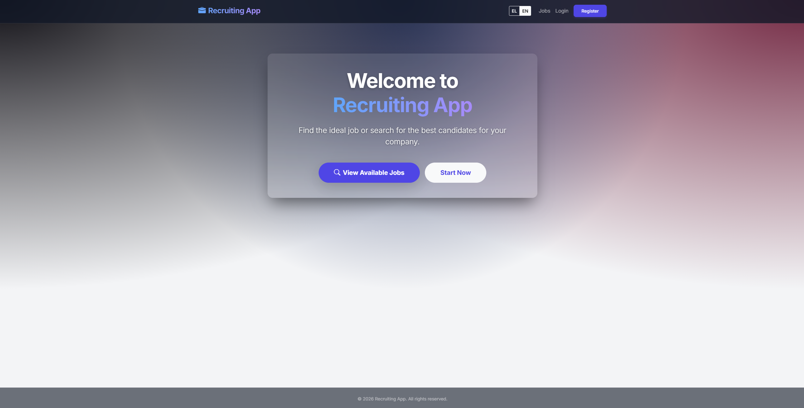
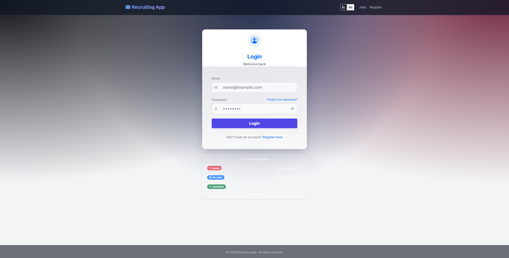
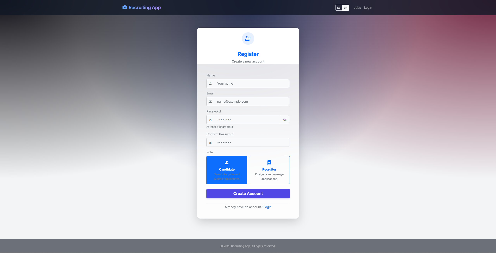
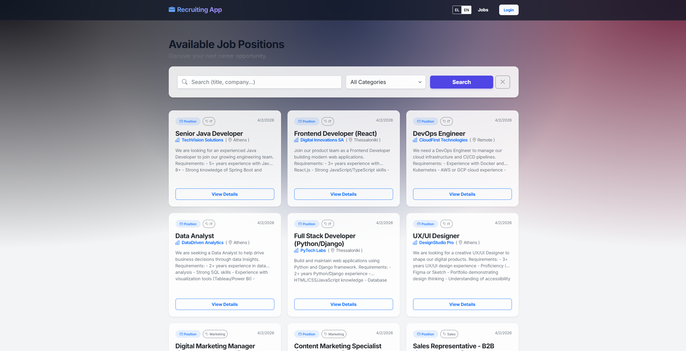
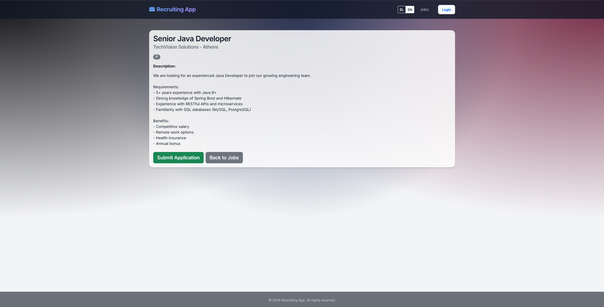
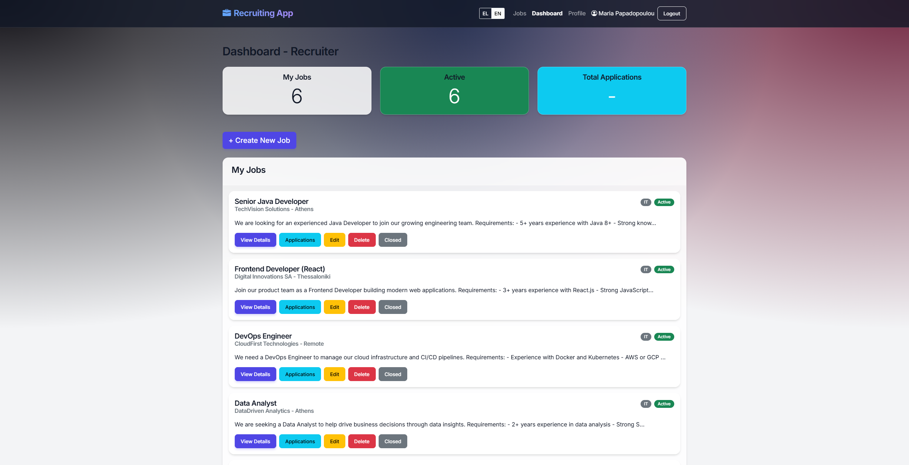
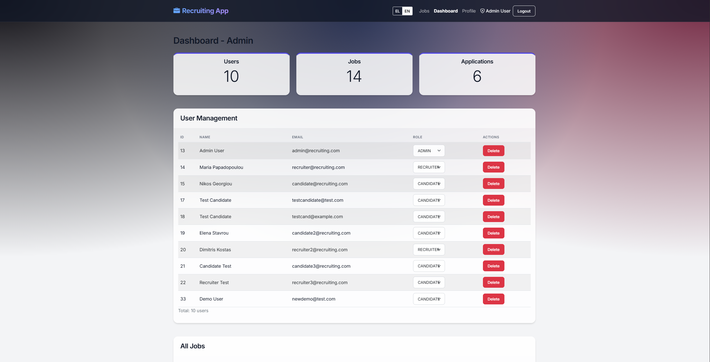

# Recruiting Web Application

A full-stack job recruiting platform built with Java Servlets, JSP, jQuery, and MySQL. Features role-based dashboards for candidates, recruiters, and administrators with full internationalization (English/Greek).

**Author:** John Kounelis

---

## Screenshots

### Home Page


### Login


### Register


### Job Listings


### Job Details


### Recruiter Dashboard


### Admin Dashboard


---

## Features

### General
- Responsive Bootstrap 5 UI with glassmorphism design
- Full internationalization (English & Greek) with client-side language switcher
- Secure authentication with hashed passwords (SHA-256)
- CSRF protection and input sanitization
- Connection pooling with HikariCP
- Demo data auto-seeded on first startup (14 jobs, 5 applications)

### Candidate
- Browse and search job listings with category filters
- View detailed job descriptions
- Apply to jobs with optional resume upload
- Track application status (Pending, Reviewed, Accepted, Rejected)
- Personal profile management

### Recruiter
- Create, edit, and close job postings
- View and manage applications per job
- Update application statuses with notes
- Dashboard with posting statistics

### Admin
- Full statistics dashboard (users, jobs, applications)
- Manage all users, jobs, and applications
- Search and filter across all data
- Delete users and job postings

---

## Tech Stack

| Layer | Technology |
|-------|-----------|
| Backend | Java 8, Servlets 3.1, JDBC |
| Frontend | JSP, jQuery 3.6, Bootstrap 5.1 |
| Database | MySQL 8.0 |
| Build | Maven 3.6+ |
| Server | Apache Tomcat 7 (embedded via Maven plugin) |
| Connection Pool | HikariCP 4.0 |
| JSON | Gson 2.10 |
| i18n | Client-side JSON translation files |

---

## Project Structure

```
recruiting-webapp/
├── src/main/java/com/recruiting/
│   ├── controller/          # Servlets (REST API endpoints)
│   ├── dao/                 # Data Access Objects (interfaces)
│   │   └── impl/            # DAO implementations (JDBC)
│   ├── filter/              # Security filters (CSRF, Auth, API)
│   ├── model/               # Data models (User, Job, Application)
│   ├── service/             # Business logic layer
│   └── util/                # Utilities (DB connection, sanitizer, demo data)
├── src/main/resources/
│   └── db.properties        # Database configuration
├── src/main/webapp/
│   ├── css/style.css        # Custom styles
│   ├── js/                  # JavaScript modules
│   │   ├── common.js        # Shared utilities
│   │   ├── i18n.js          # Internationalization engine
│   │   ├── jobs.js          # Jobs listing page
│   │   ├── job-details.js   # Job detail & apply
│   │   ├── login.js         # Login page logic
│   │   ├── register.js      # Registration with password strength
│   │   ├── candidate-dashboard.js
│   │   ├── recruiter-dashboard.js
│   │   ├── job-applications.js
│   │   └── admin-dashboard.js
│   ├── i18n/
│   │   ├── en.json          # English translations
│   │   └── el.json          # Greek translations
│   ├── index.jsp            # Home page
│   ├── login.jsp            # Login with demo credentials
│   ├── register.jsp         # Registration with role selection
│   ├── jobs.jsp             # Public job listings
│   ├── job-details.jsp      # Job detail view
│   ├── forgot-password.jsp  # Password reset
│   ├── candidate/           # Candidate pages
│   │   ├── dashboard.jsp
│   │   └── profile.jsp
│   ├── recruiter/           # Recruiter pages
│   │   ├── dashboard.jsp
│   │   └── job-applications.jsp
│   └── admin/
│       └── dashboard.jsp    # Admin panel
├── sql/
│   ├── database_schema.sql  # Full schema + seed data
│   └── demo_data.sql        # Additional demo data script
├── pom.xml
├── LICENSE
└── README.md
```

---

## Getting Started

### Prerequisites

- **Java 8+** (JDK)
- **Maven 3.6+**
- **MySQL 8.0+**

### 1. Clone the Repository

```bash
git clone https://github.com/johnkounelis/java-recruiting.git
cd java-recruiting
```

### 2. Set Up the Database

```bash
mysql -u root -p < sql/database_schema.sql
```

This creates the `recruiting_db` database with all tables and inserts 3 default users.

### 3. Configure Database Credentials

Edit `src/main/resources/db.properties`:

```properties
db.url=jdbc:mysql://localhost:3306/recruiting_db?useSSL=false&serverTimezone=UTC&allowPublicKeyRetrieval=true
db.username=root
db.password=YOUR_PASSWORD_HERE
```

### 4. Build and Run

```bash
mvn clean compile
mvn tomcat7:run
```

The app starts at: **http://localhost:8080/recruiting-webapp/**

> On first startup, the app automatically seeds 14 demo jobs and 5 sample applications.

---

## Demo Accounts

| Role | Email | Password |
|------|-------|----------|
| Admin | `admin@recruiting.com` | `admin123` |
| Recruiter | `recruiter@recruiting.com` | `recruiter123` |
| Candidate | `candidate@recruiting.com` | `candidate123` |

You can also click the demo credentials on the login page to auto-fill.

---

## Pages & Routes

| Page | URL | Access |
|------|-----|--------|
| Home | `/` | Public |
| Login | `/login.jsp` | Public |
| Register | `/register.jsp` | Public |
| Jobs Listing | `/jobs.jsp` | Public |
| Job Details | `/job-details.jsp?id={id}` | Public |
| Forgot Password | `/forgot-password.jsp` | Public |
| Candidate Dashboard | `/candidate/dashboard.jsp` | Candidate |
| Candidate Profile | `/candidate/profile.jsp` | Candidate |
| Recruiter Dashboard | `/recruiter/dashboard.jsp` | Recruiter |
| Job Applications | `/recruiter/job-applications.jsp?jobId={id}` | Recruiter |
| Admin Dashboard | `/admin/dashboard.jsp` | Admin |

---

## API Endpoints

| Method | Endpoint | Description | Auth |
|--------|----------|-------------|------|
| `POST` | `/api/login` | User login | - |
| `POST` | `/api/register` | User registration | - |
| `POST` | `/api/logout` | Logout | Any |
| `GET` | `/api/session` | Check session status | Any |
| `GET` | `/api/jobs` | List active jobs (paginated) | - |
| `GET` | `/api/jobs?search=keyword` | Search jobs | - |
| `GET` | `/api/jobs/{id}` | Get job details | - |
| `POST` | `/api/jobs` | Create job | Recruiter |
| `PUT` | `/api/jobs/{id}` | Update job | Recruiter |
| `DELETE` | `/api/jobs/{id}` | Delete job | Recruiter/Admin |
| `GET` | `/api/applications/my` | Candidate's applications | Candidate |
| `POST` | `/api/applications` | Apply to job | Candidate |
| `GET` | `/api/applications/job/{id}` | Applications for a job | Recruiter |
| `POST` | `/api/applications/update` | Update application status | Recruiter |
| `GET` | `/api/applications/all` | All applications | Admin |
| `GET` | `/api/statistics` | Dashboard statistics | Any |
| `GET` | `/api/users` | List all users | Admin |
| `GET/PUT` | `/api/profile` | User profile | Any |

---

## Internationalization (i18n)

The app supports **English** and **Greek** via a language toggle in the navigation bar. Translations are stored in JSON files (`i18n/en.json`, `i18n/el.json`) with 200+ keys covering every page section. The language preference persists in `localStorage`.

---

## License

This project is licensed under the MIT License - see the [LICENSE](LICENSE) file for details.

---

**Built by John Kounelis**
